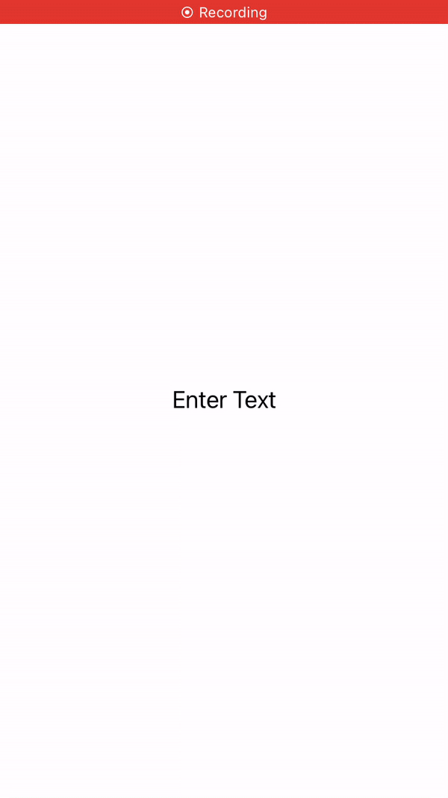

# MarkupTextView

[](https://developer.apple.com/swift)

Dynamic textview with auto-resizing height & width that is also movable/draggable. 



## Requirements
iOS 13 or above

## Installation
MarkupTextView is installed via the official [Swift Package Manager](https://swift.org/package-manager/).  

Select `Xcode`>`File`> `Swift Packages`>`Add Package Dependency...`  
and add `https://github.com/qkrtjrrnjs/MarkupTextView`.

## Usage

- **First import MarkupTextView**
    ```swift
    import MarkupTextView
    ```

- **Implementation**
    ```swift
    let textView = MarkupTextView()
    textView.placeholder = "Enter Text"
    textView.font = UIFont.systemFont(ofSize: 20)
    textView.drag = .always
    textView.maxHeight = 100
    textView.maxWidth = 100
    ```

## License

MarkupTextView is under MIT license. See the [LICENSE](LICENSE) file for more information.
